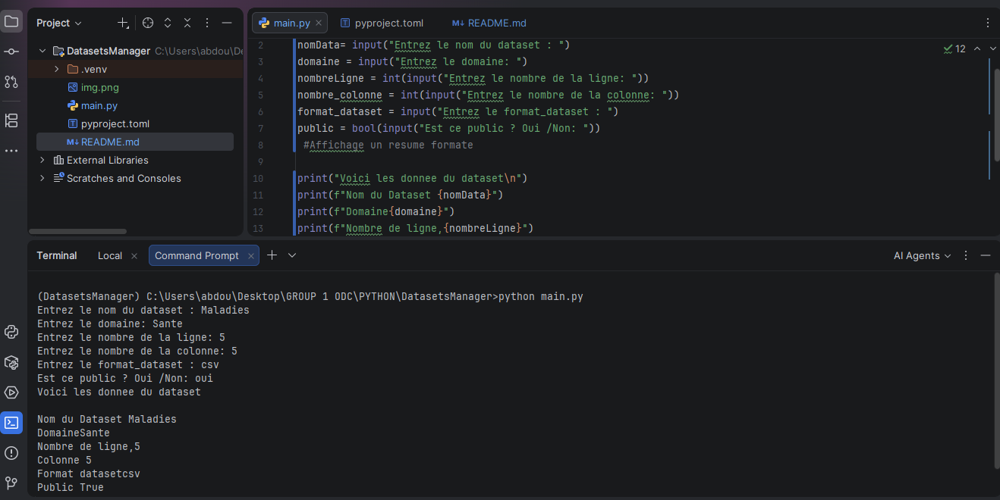

# Partie 1 : Types de base, variables, entrées et sorties
## Présentation
Dans cette première partie, j'ai développé une application console permettant de saisir les principales métadonnées d'un dataset et d'afficher un résumé des informations saisies.
---
# Concepts utilisés

## Variables

Les variables permettent de stocker des informations en mémoire afin de les réutiliser dans le programme.

**Syntaxe**

```python
nom = valeur
```

**Exemple**

```python
nom_dataset = "Titanic"
```

Sans les variables, il faudrait saisir ou écrire les mêmes informations plusieurs fois dans le programme.

---

## Types de données

Les types permettent à Python de connaître la nature des informations manipulées.

Types utilisés :

- `str` : texte
- `int` : nombre entier
- `float` : nombre décimal
- `bool` : vrai ou faux

Sans les types de données, Python ne pourrait pas effectuer correctement les opérations sur les valeurs.

---

## La fonction `input()`

La fonction `input()` permet de récupérer une information saisie par l'utilisateur au clavier.

**Syntaxe**

```python
input("Votre message")
```

**Exemple**

```python
nom = input("Entrez le nom du dataset : ")
```

Cette fonction retourne toujours une chaîne de caractères (`str`).

Sans `input()`, le programme ne pourrait pas interagir avec l'utilisateur.

---

## La fonction `print()`

La fonction `print()` permet d'afficher des informations à l'écran.

**Syntaxe**

```python
print(valeur)
```

**Exemple**

```python
print(nom)
```

Sans `print()`, le programme effectuerait les traitements sans afficher les résultats à l'utilisateur.

---


# Ce que j'ai réalisé

Au cours de cette partie, j'ai :

- créé une application console ;
- récupéré les informations d'un dataset ;
- stocké les données dans des variables ;
- affiché un résumé des informations saisies.

---

# Conclusion

Cette première partie m'a permis de comprendre les bases de Python et de mettre en pratique les notions de variables, types de données, saisie utilisateur et affichage des résultats. Ces concepts serviront de fondation pour les prochaines étapes du projet. 