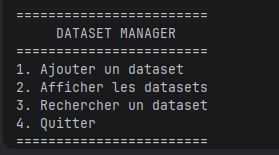
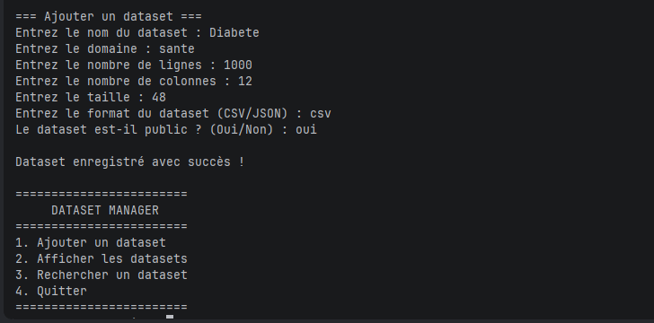

# DatasetManager

## Application de gestion de jeux de données

### Orange Digital Center - Programme P1 IA

---

# Présentation

DatasetManager est une application console développée en Python dans le cadre de la formation **P1 Intelligence Artificielle**.

L'objectif de cette application est de permettre la gestion d'un catalogue de jeux de données (datasets). Au fil des différentes parties du projet, de nouvelles fonctionnalités sont progressivement ajoutées afin de mettre en pratique les notions fondamentales de Python.

Les principales fonctionnalités attendues sont :

- ajout d'un dataset ;
- affichage des datasets ;
- recherche d'un dataset ;
- modification des informations ;
- suppression d'un dataset ;
- affichage des statistiques ;
- sauvegarde dans un fichier ;
- rechargement automatique des données ;
- gestion des erreurs.

---

# Technologies utilisées

- Python 3
- Terminal Windows
- Git
- GitHub
- PyCharm

---

# Structure du projet

```
datasetManager/
│── main.py
│── README.md
│── img/
```

---

# Partie 1 : Types de base, variables, entrées et sorties

## Présentation

Cette première partie consiste à développer une application console permettant de saisir les principales métadonnées d'un dataset puis d'afficher un résumé des informations enregistrées.

Cette étape introduit les notions fondamentales de Python, notamment les variables, les types de données ainsi que les fonctions d'entrée et de sortie.

---

## Les variables

Les variables permettent de stocker des informations en mémoire afin de pouvoir les réutiliser tout au long de l'exécution du programme.

### Syntaxe

```python
nom_variable = valeur
```

### Exemple

```python
nom_dataset = "Titanic"
```

Sans les variables, chaque information devrait être ressaisie à chaque utilisation.

---

## Les types de données

Les types de données permettent à Python d'identifier la nature des informations manipulées.

Types utilisés :

- `str`
- `int`
- `float`
- `bool`

Chaque type possède un rôle précis dans le traitement des données.

---

## La fonction input()

Permet de récupérer une information saisie par l'utilisateur.

### Syntaxe

```python
input("Message")
```

### Exemple

```python
nom = input("Nom : ")
```

Sans cette fonction, aucune interaction avec l'utilisateur ne serait possible.

---

## La fonction print()

Permet d'afficher des informations dans le terminal.

### Syntaxe

```python
print(valeur)
```

### Exemple

```python
print(nom)
```

Sans cette fonction, le programme effectuerait les traitements sans afficher les résultats.
[img_3.png](img_3.png)

---

## Résultat obtenu

Cette première partie permet :

- la saisie des métadonnées d'un dataset ;
- le stockage des informations dans des variables ;
- l'affichage d'un résumé des données saisies.

Cette première partie introduit les bases de Python qui seront utilisées dans toutes les étapes suivantes du projet.
---
# Partie 2 : Structures de contrôle
Cette partie transforme l'application en un programme interactif grâce à un menu permettant de sélectionner différentes actions.

Les notions abordées sont la boucle `while`, l'instruction `match...case`, le mot-clé `break` ainsi que le module `os`.

---

## La boucle while

La boucle `while` permet de répéter un bloc d'instructions tant qu'une condition reste vraie.

### Syntaxe

```python
while condition:
```

### Exemple

```python
while True:
```

Cette boucle maintient le programme actif jusqu'au choix de l'utilisateur de quitter l'application.

Sans cette boucle, le menu ne serait affiché qu'une seule fois.

---

## L'instruction match...case

Permet d'exécuter un traitement différent selon la valeur saisie.

### Syntaxe

```python
match variable:
    case valeur:
```

Chaque option du menu est associée à un `case`.

Cette structure améliore la lisibilité du programme.

---

## Le mot-clé break

Permet d'interrompre immédiatement une boucle.

### Syntaxe

```python
break
```

Cette instruction est utilisée lorsque l'utilisateur choisit l'option **Quitter**.

Sans `break`, la boucle continuerait indéfiniment.

---

## Le module os

Le module `os` permet d'interagir avec le système d'exploitation.

### Importation

```python
import os
```

### Effacer le terminal sous Windows

```python
os.system("cls")
```

Cette instruction efface l'écran afin de proposer une interface plus propre et plus lisible.

Sous Linux ou macOS, la commande équivalente est :

```python
os.system("clear")
```

---


```md
```
---

## Résultat obtenu

À l'issue de cette partie, l'application permet :

- d'afficher un menu interactif ;
- d'ajouter un dataset ;
- d'afficher les informations enregistrées ;
- de quitter proprement l'application.

---

Cette partie introduit les structures de contrôle nécessaires à la réalisation d'une application interactive en Python.

# Partie 3 : Dictionnaires

> À compléter.

---

# Partie 4 : Tuples

> À compléter.

---

# Partie 5 : Listes

> À compléter.

---

# Partie 6 : Compréhensions

> À compléter.

---

# Partie 7 : Fichiers

> À compléter.

---

# Partie 8 : Exceptions

> À compléter.

---

# Partie 9 : Fonctions

> À compléter.

---

# Partie 10 : Modules

> À compléter.

---

# Partie 11 : Packages

> À compléter.

---

# Partie 12 : Bonus

> À compléter.

---

# Conclusion générale

Ce projet a permis de mettre progressivement en pratique les principales notions de Python, depuis les bases du langage jusqu'à l'organisation d'une application complète. Chaque partie apporte une nouvelle fonctionnalité tout en consolidant les connaissances acquises précédemment.

---

# Auteur

**Baye Abdoul Aziz Seck**

Formation P1 Intelligence Artificielle

Orange Digital Center